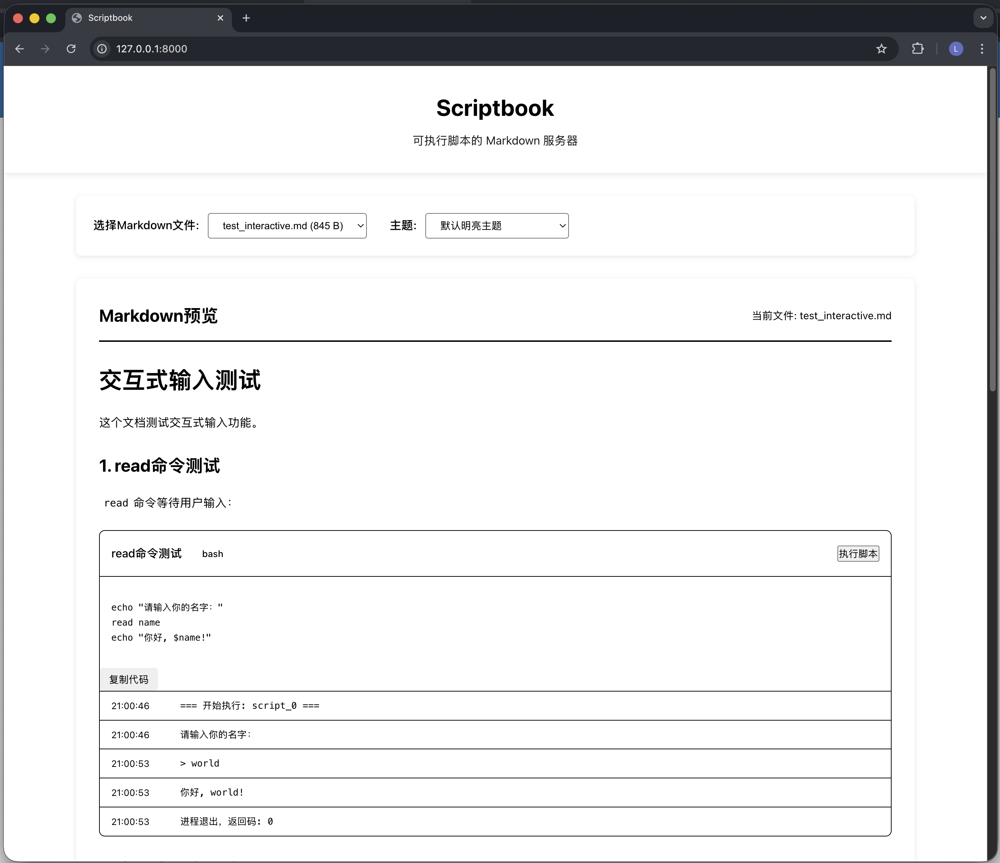

# SOP Online - 标准操作流程执行工具

一个交互式的SOP（标准操作流程）在线执行工具，借鉴Jupyter Notebook的设计理念，支持在Markdown文档中嵌入可执行脚本，提供实时输出和交互式体验。

## ✨ 功能特性

- **交互式SOP** - 在Markdown中嵌入可执行脚本，类似Jupyter Notebook
- **实时执行** - WebSocket实现脚本实时输出流
- **独立输出** - 每个SOP步骤下方有独立的输出区域
- **多文档支持** - 支持多个SOP文档切换
- **主题切换** - 支持明亮和暗色主题
- **标准流程** - 适用于企业标准操作流程的展示和执行

## 🖼️ 截图预览



## 🚀 快速开始

### 环境要求
- Python 3.14+
- 现代浏览器

### 安装

```bash
# 直接安装（推荐）
pip install sop-online

# 或者从源码安装
git clone https://github.com/lengmoXXL/sop_online.git
cd sop_online
pip install .
```

### 使用方法

```bash
# 启动服务（使用默认content目录）
sop_online content/

# 指定自定义SOP目录
sop_online /path/to/my/sop/documents/

# 指定端口
sop_online content/ --port 9000

# 允许外部访问
sop_online content/ --host 0.0.0.0

# 访问应用
open http://localhost:8000
```

**注意**: 修改代码后请手动重启服务以应用更改。

## 📦 发布信息

### PyPI安装

```bash
pip install sop-online
```

**PyPI链接**: https://pypi.org/project/sop-online/

### 版本

- 当前版本: 1.0.0
- Python要求: >=3.14

### 许可证

MIT License

### GitHub仓库

- 源码: https://github.com/lengmoXXL/sop_online
- 问题反馈: https://github.com/lengmoXXL/sop_online/issues

## 🧪 测试

```bash
# 运行单元测试
pytest src/tests/

# 运行功能测试
pytest src/integration_tests/test_sop_online_pytest.py -v
```

## 📝 开发指南

### 本地开发

```bash
# 克隆仓库
git clone https://github.com/lengmoXXL/sop_online.git
cd sop_online

# 创建虚拟环境
python -m venv .venv
source .venv/bin/activate

# 开发模式安装
pip install -e .

# 运行测试
pytest src/tests/ -v
```

### 发布到PyPI

```bash
# 构建包
python -m build

# 上传到PyPI
twine upload dist/*
```

或者使用GitHub Actions进行自动发布。

---

**SOP Online** - 让标准操作流程更易于理解和执行 📖
