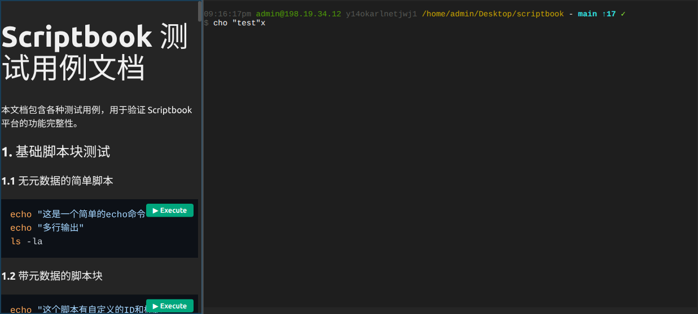

# Scriptbook

交互式终端和文档浏览器，支持在 Web 界面中浏览 Markdown 文档、执行脚本和管理终端会话。



## 特性

- **Markdown 渲染** - 支持代码块语法高亮和一键执行
- **交互式终端** - 基于 xterm.js 的现代化终端体验
- **窗口管理** - 支持分割、拖拽重排、布局保存
- **多语言支持** - bash、python、shell 等

## 安装

```bash
pip install scriptbook
```

## 快速开始

```bash
# 启动服务
scriptbook server <目录> --port 8080

# 访问 http://localhost:8080
```

## 截图

**文件选择器**


## 文件类型

| 扩展名 | 说明 |
|--------|------|
| `.md` | Markdown 文档，代码块可执行 |
| `.tl` | Terminal 配置文件 |
| `.layout.json` | 窗口布局文件 |

## 快捷键

| 快捷键 | 功能 |
|--------|------|
| `Ctrl+P` | 打开文件选择器 |
| `Ctrl+Enter` | 右侧分割打开 |
| `Alt+Enter` | 下侧分割打开 |
| `Esc` | 取消焦点 |

## 文档

- [开发文档](docs/development.md)
- [发布流程](docs/release.md)

## License

MIT
